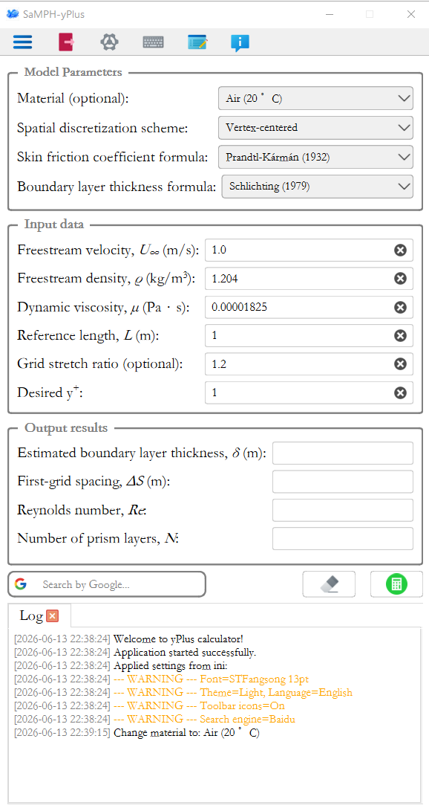
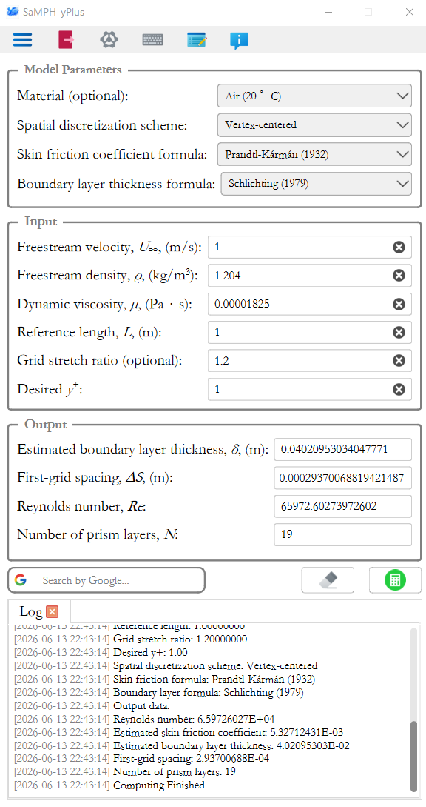
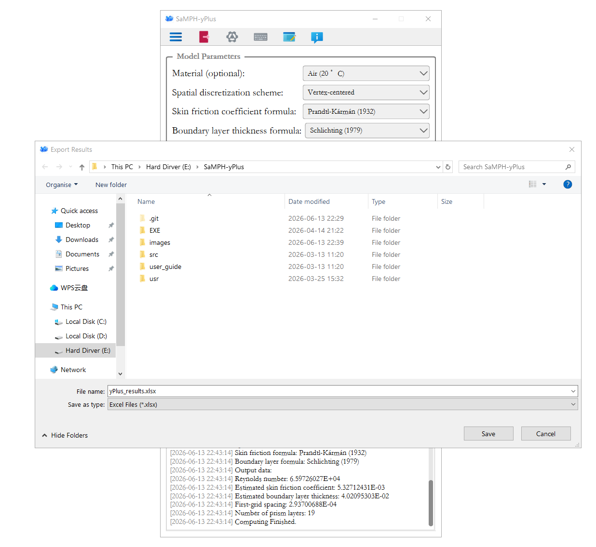

<p align="center">
  
</p>

<h1 align="center">SaMPH-yPlus</h1>

<p align="center">
  <strong>Advanced CFD y+ and First-Grid Spacing Calculator</strong>
</p>

<p align="center">
  <a href="#features">Features</a> •
  <a href="#installation">Installation</a> •
  <a href="#quick-start">Quick Start</a> •
  <a href="#methodology">Methodology</a> •
  <a href="#screenshots">Screenshots</a> •
  <a href="#license">License</a>
</p>

<p align="center">
  
  
  
  
</p>

---

## Overview

**SaMPH-yPlus** is a professional desktop application designed for CFD (Computational Fluid Dynamics) engineers and researchers. It provides a modern, user-friendly interface to calculate critical near-wall grid parameters, including **y+**, **first-grid spacing**, **Reynolds number**, and **boundary layer thickness**.

By accurately estimating the first layer height, users can ensure their mesh adheres to the requirements of various turbulence models, leading to more reliable and convergent simulations.

---

## Features

### 🚀 Scientific Core

- **First-Grid Spacing ($\Delta S$)**: Automatic calculation based on target $y^+$ and flow conditions.
- **Multiple Skin Friction ($C_f$) Formulas**:
  - Prandtl-Schlichting (1979)
  - ITTC-1957 (Ship correlation line)
  - Prandtl-Kármán (1932)
- **Boundary Layer Thickness ($\delta$) Estimation**:
  - Schlichting (1979)
  - White (1991)
- **Mesh Layering**: Estimate the number of prism layers ($N$) required to cover the boundary layer based on a specific grid stretch ratio.
- **Spatial Discretization Support**: Handles both **Cell-centered** and **Vertex-centered** schemes.

### 🖥️ Modern Windows 10 GUI

- **Clean Interface**: Built with **PySide6 / Qt6** following modern design principles.
- **Interactive Tools**:
  - Integrated **Virtual Keyboard** for touch or mouse-driven input.
  - Built-in **Search Bar** (Google/Baidu) for quick access to CFD theory.
- **Real-time Logging**: Comprehensive log panel to track calculation steps and warnings.
- **Input Validation**: Ensures physical realism for velocities, densities, and lengths.

### 🌐 Global Readiness

- **Multilingual**: Supports English and 中文 (Simplified Chinese).
- **Auto-detection**: Smart language and theme loading based on user settings.
- **Persistent Settings**: Remembers your preferred formulas, units, and appearance.

---

## Installation

### Option A — Standalone executable (Windows, no Python required)

This is the recommended option for most users.

1. Go to the [Releases page](https://github.com/mini-walker/SaMPH-yPlus/releases/tag/v1.0.0).
2. Download `SaMPH-yPlus-V1.0.0.zip`.
3. Extract the archive to any folder.
4. Double-click `SaMPH-yPlus.exe` to launch.

No Python installation or additional configuration is required.

### Option B — Python source package

For users who need customisation or wish to integrate the solver into automated pipelines.

**Requirements:** Python 3.13, pip

```bash
# 1. Clone the repository
git clone https://github.com/mini-walker/SaMPH-yPlus.git
cd SaMPH-yPlus

# 2. Install dependencies
pip install -r requirements.txt

# 3. Launch the application
python src/Main.py
```

**Core dependencies:**

| Package  | Version | Purpose                        |
|----------|---------|--------------------------------|
| PySide6  | 6.5.0   | GUI framework                  |
| NumPy    | 1.24.0  | Numerical computations         |
| SciPy    | 1.10.0  | Scientific utilities           |
| Pandas   | 2.0.0   | Data export (CSV/XLSX)         |
| OpenPyXL | 3.1.0   | Excel file writing             |
| Requests | 2.28.0  | Integrated web search          |

---

## User Guide

This section provides a step-by-step guide to using the SaMPH-yPlus application.

1. **Set model parameters** — In the *Model Parameters* panel, choose your fluid (or enter density and viscosity manually), select the spatial discretization scheme matching your CFD solver, and pick the empirical formulas for $C_f$ and $\delta$.


2. **Enter flow conditions** — In the *Input* panel, fill in freestream velocity, freestream density, dynamic viscosity, and reference length. Optionally enter a grid stretch ratio (required for prism layer count) and your target y⁺.
<div align="center">

</div>
<p align="center">
<b>Figure 1.</b> Input panel filled with the flat-plate benchmark values (see Worked Example).
</p>


3. **Compute** — Click the *Compute* button. Results appear immediately in the *Output* panel.

<div align="center">

</div>
<p align="center">
<b>Figure 2.</b> Output panel with computed results.
</p>

4. **Export results (optional)** — Click the *Export CSV* or *Export Excel* button to save the current calculation parameters and results to a file. This is especially useful for batch processing or record-keeping.

<div align="center">

</div>
<p align="center">
<b>Figure 3.</b> Export results to CSV or Excel.
</p>


---


## Worked Example

The following reproduces the flat-plate benchmark reported in the companion paper (Table 3). Use these values to verify that the software is installed and working correctly.

**Test case:** Flow over a flat plate, air at 20 $^\circ$C, vertex-centered solver.

**Inputs**

| Parameter | Symbol | Value |
|-----------|--------|-------|
| Freestream velocity | $U_\infty$ | 1.0 m/s |
| Freestream density | $\rho$ | 1.204 kg/m$^3$ |
| Dynamic viscosity | $\mu$ | $1.825 \times 10^{-5}$ Pa·s |
| Reference length | $L$ | 1.0 m |
| Spatial discretization | — | Vertex-centered |
| $C_f$ formula | — | Prandtl–Kármán (1932) |
| $\delta$ formula | — | Schlichting (1979) |
| Target $y^+$ | $y^+$ | 1.0 |
| Grid stretch ratio | $r$ | 1.2 |

**Expected outputs**

| Parameter | Symbol | Expected value |
|-----------|--------|---------------|
| Reynolds number | $\mathrm{Re}$ | $6.597 \times 10^{5}$ |
| Skin friction coefficient | $C_f$ | $6.405 \times 10^{-3}$ |
| Boundary layer thickness | $\delta$ | $4.021 \times 10^{-2}$ m |
| First-grid spacing | $\Delta S$ | $2.937 \times 10^{-4}$ m |
| Number of prism layers | $N$ | 19 |

Re and $\Delta S$ should match Cadence Pointwise to within 0.05% and exactly, respectively. Input files for this case and kcs bare-hull are provided in the `validation/` directory of this repository.

---


## Project Structure

```
SaMPH-yPlus/
├── src/
│   ├── Main.py                 # Entry point
│   ├── Algorithm/
│   │   └── Calculate_yPlus.py  # Core physics & math logic
│   └── GUI/
│       ├── GUI_Application.py  # Main window assembly
│       ├── Operation_*.py      # Business logic controllers
│       ├── Page_*.py           # UI components (Settings, Log, Menu)
│       ├── Utils.py            # Path handling & unit conversions
│       └── Language_Manager.py # i18n support
├── images/                     # Icons and logos
├── usr/                        # User settings & logs (Git ignored)
├── requirements.txt            # Dependencies
├── Generate_single_exe.bat     # Build script
└── README.md
```

---

## License

This project is licensed under the **MIT License** — see the [LICENSE](LICENSE) file for details.

---

## Acknowledgements

**Author**: Shanqin Jin
**Contact**: sjin@mun.ca
